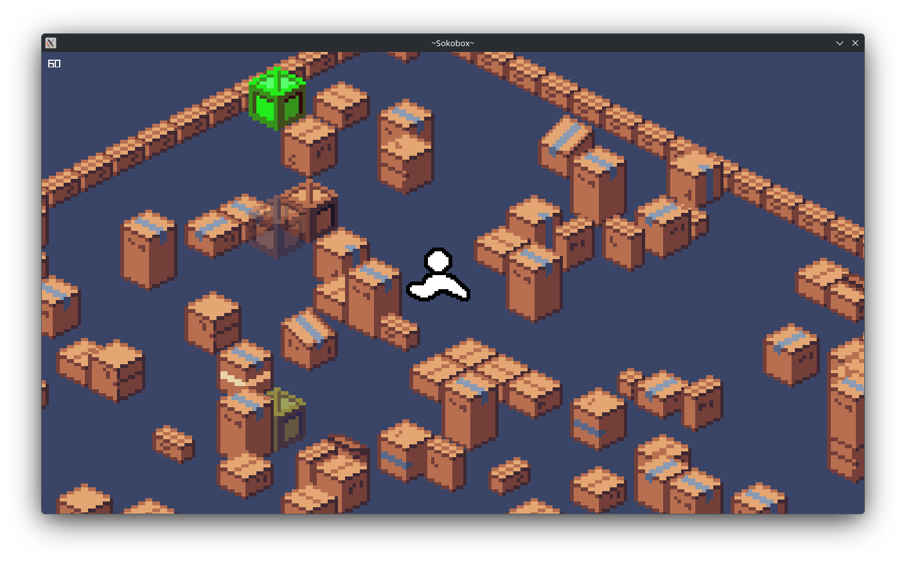

# Sokobox - A sokoban/xye inspired puzzle game.

**A puzzle game where you push boxes to reach objects or unlock doors, to eventually complete a level.**

**NOTE:** Also check `20260628_sample.mp4` for a brief demo clip.

## Quick Start

To get started with building from source, you can download this repository and install `libzstd-dev` on your system, clone this repo's git submodules (Raylib), then run `build.sh`.

## Game Rules

Each level of this game has a set goal of either collecting all the objects required, or placing all boxes in the correct shadow area spots on the map.

The player can move along the xy plane provided by the isometric view using the `WASD` keys, run with `LSHIFT`, or move boxes and pick up objects by running into them, if not blocked.

It is also possible to zoom the camera in and out with the scroll wheel, move the camera by moving the mouse while holding `LMB`, or reset it with `RMB`.

## Game Renderer

The game is made using Raylib, which is provided to this project as a git submodule to potentially keep updates easy. The isometric view is rendered in software, and various sprite atlases are loaded to provide the world elements and transitions.

This simple engine allows up to 7 stacked tiles per tile area including animations, but not allowing walkable transparent tile stacking. The only playable height level is the lowest one at this time.

The build process gives Raylib the OpenGL 4.3 target, but this can be changed in the main `build.sh` script.

## Levelsets and Level Handling

See `static/levels/README.md`.

The levelset descriptor is handled using the INI parser and generator library `inipp`.

Serialization is handled via the `cereal` and `bxzstr` libraries, for serializing the main world data structures and compress its stream using Zstandard respectively. A checksum is also added to the level data to avoid possible corruption before compression, if necessary.

**NOTE:** Make sure to install `libzstd-dev` or your distro's `zstd` provider to build from source.

## Ongoing Work

+ Move rendered game into texture surface to add `rlImgui` GUI elements around main game
+ Add level editor
+ Add main levelset (porting standard microban levels and xye microban levels)
+ Isometric view rotation
+ Sound effects and BGM